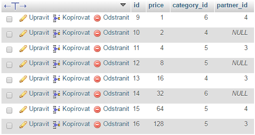
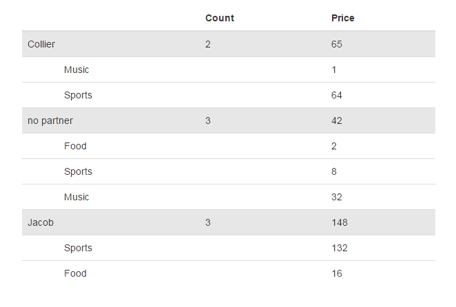

pcz/groupie documentation
==================================

This library helps you to build structured aggregated data from flat collections (see the picture below)

... a bit of magic and voila!:

  
The object model should not be hard to understand, see tests for example usage. Also, you can find an example view component
for the [Nette framework](https://nette.org/) here: [https://github.com/petrofcz/groupie-nette-component](https://github.com/petrofcz/groupie-nette-component)
